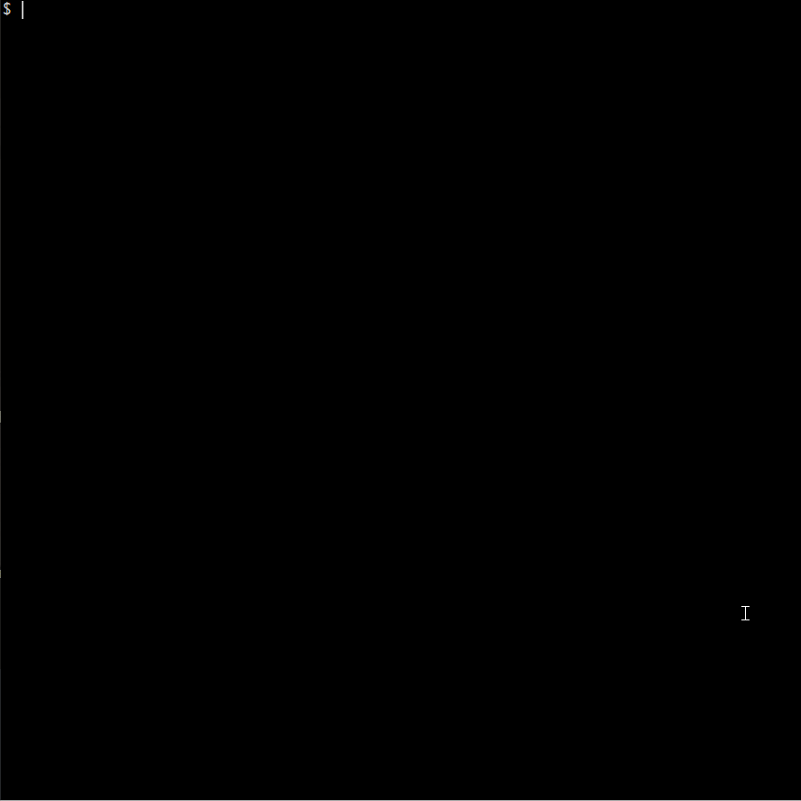

# js-utils


Коллекция утилит на чистом JavaScript: мемоизация, debounce, композиция функций и другие приёмы функционального программирования.

## Демонстрация



## Установка

```bash
git clone https://github.com/yuhjn69/js-utils.git
cd js-utils
```

## Использование

```js
const { memoize, debounce } = require('./src/index');
```

## Функции

### memoize(fn)

Мемоизирует функцию — кэширует результаты по аргументам.

- `fn` (Function) — функция для мемоизации

Возвращает: Function — обёртка с кэшем.

```js
const slowSquare = memoize((n) => n * n);
slowSquare(7); // 49 (вычислено)
slowSquare(7); // 49 (из кэша)
```

### once(fn)

Выполняет функцию только при первом вызове. Все последующие вызовы возвращают результат первого вызова, не выполняя fn повторно.

- `fn` (Function) — функция для однократного выполнения

Возвращает: Function — обёртка, вызывающая fn только один раз.

```js
let calls = 0;
const init = once(() => { calls++; return 'done'; });
init(); // 'done', calls = 1
init(); // 'done', calls = 1 (fn не вызвана)
```

### partial(fn, ...args)

Создаёт новую функцию, где первые аргументы фиксированы.

- `fn` (Function) — функция, которую нужно частично применить
- `...args` — аргументы, фиксируемые в новой функции

Возвращает: Function — новая функция с фиксированными аргументами.

```js
const add = (a, b, c) => a + b + c;
const add5 = partial(add, 5);
add5(2, 3); // add(5, 2, 3) = 10

const add5and2 = partial(add, 5, 2);
add5and2(3); // add(5, 2, 3) = 10
```

### compose(...fns)

Принимает функции, применяемые справа налево.

- `...fns` (...Function) — функции для композиции

Возвращает: Function — новая функция, применяющая fns справа налево.

```js
const add1 = x => x + 1;
const double = x => x * 2;
const square = x => x * x;

const f = compose(square, double, add1);
f(2); // square(double(add1(2))) = 36
```

### pipe(...fns)

Принимает функции, применяемые слева направо.

- `...fns` (...Function) — функции для композиции

Возвращает: Function — новая функция, применяющая fns слева направо.

```js
const add1 = x => x + 1;
const double = x => x * 2;
const square = x => x * x;

const f = pipe(add1, double, square);
f(2); // square(double(add1(2))) = 36
```

### memoizeLast(fn)

Мемоизирует функцию — кэширует последний результат по аргументам.

- `fn` (Function) — функция для мемоизации

Возвращает: Function — обёртка с кэшем последнего вычисления.

```js
const slowSquare = memoizeLast((n) => n * n);
slowSquare(7); // 49 (вычислено)
slowSquare(6); // 36 (вычислено)
slowSquare(6); // 36 (из кэша)
slowSquare(7); // 49 (вычислено заново)
```

### debounce(fn, delay)

Откладывает вызов функции, пока не пройдёт delay (мс) без новых вызовов.

- `fn` (Function) — функция, вызов которой нужно отложить
- `delay` (number) — задержка в мс

Возвращает: Function — обёртка, сбрасывающая предыдущий таймер и вызывающая fn через delay мс.

```js
let calls = 0;
const debounced = debounce(() => calls++, 100);

debounced();
debounced();
debounced();

console.log(calls); // 0 — таймер ещё не сработал
setTimeout(() => console.log(calls), 150); // 1 — сработал только последний
```

## Тесты

```bash
node test.js
```

## Лицензия

[ISC](https://opensource.org/licenses/ISC)

## Автор

[yuhjn69](https://github.com/yuhjn69)